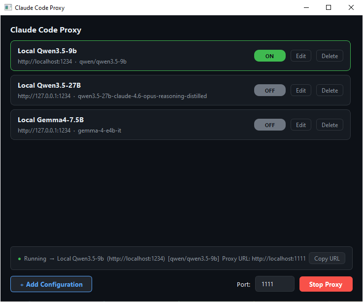

# Claude Code Proxy

A local HTTP proxy that lets you route Claude Code requests to different API endpoints without changing environment variables between sessions. Toggle configurations on/off from a GUI — switching keys, base URLs, or models in one click.



## How it works

- Runs a local HTTP server (default port `1111`)
- **No config active** → forwards requests to `https://api.anthropic.com`, passing your auth header through untouched
- **Config active** → forwards to that config's URL and replaces the auth header with its token

For Claude Code to route through the proxy, set the environment variable before starting it:

```
ANTHROPIC_BASE_URL=http://localhost:1111
```

The port can be changed in the UI before starting the proxy — update the env var to match if you do.

## Model switching

When a configuration has a **Model** field set, the proxy rewrites the `model` field in every outgoing request body to that value. This lets you point Claude Code at a local backend without worrying about model name mismatches.

When the active model changes (different config toggled, or first request after startup), the proxy automatically unloads any previously loaded models on the backend before the new request reaches it:

1. `GET /api/v1/models` — fetches the list of loaded model instances
2. `POST /api/v1/models/unload` — unloads each instance that isn't the target model

This matches the [LM Studio REST API](https://lmstudio.ai/docs/api/rest-api). On any other backend these two calls fail silently and forwarding continues normally — model switching is a best-effort, non-blocking operation.

## Running from source

**Requirements:** Python 3.11+, PySide6

```bash
pip install PySide6
python proxy.py
```

## Building the executable

**Requirements:** Python 3.11+, PyInstaller

```powershell
.\build.ps1
```

The executable is output to `dist\claude-proxy.exe`.

> If PyInstaller is not installed, the script will install it automatically.

## Running the executable

1. Copy `dist\claude-proxy.exe` to any folder
2. Run `claude-proxy.exe`
3. Add configurations (name, base URL, auth token, model)
4. Toggle a configuration ON to activate it
5. Set the `ANTHROPIC_BASE_URL` system environment variable to the displayed Proxy URL and start the proxy. 

`configs.json` is created automatically in the same directory as the executable and persists your configurations between sessions.
